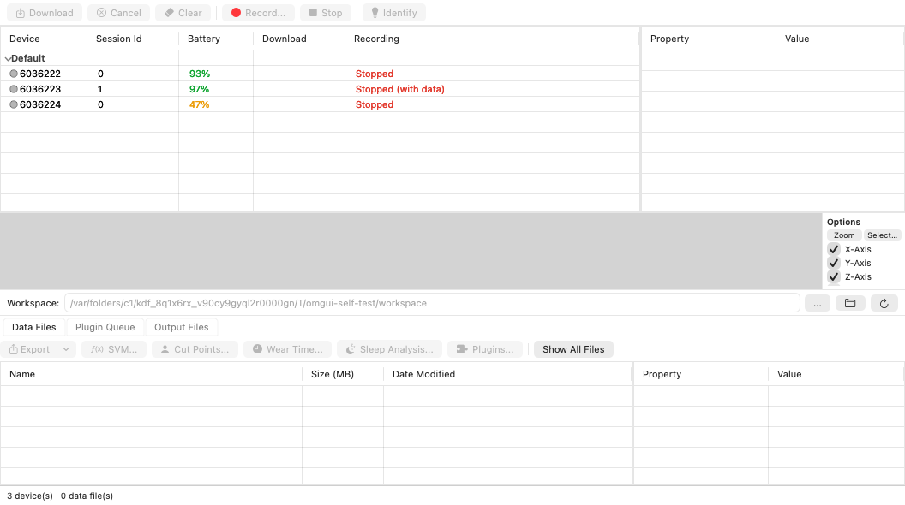
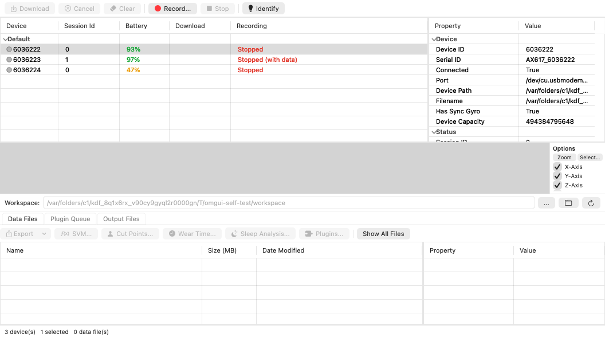
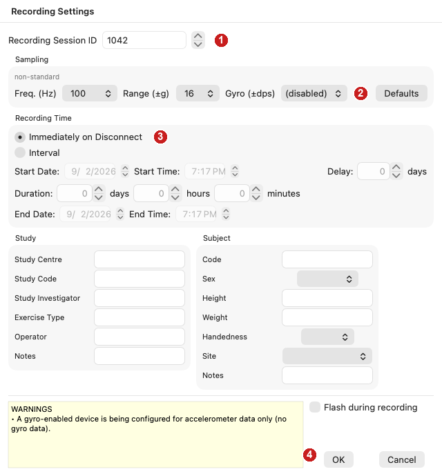
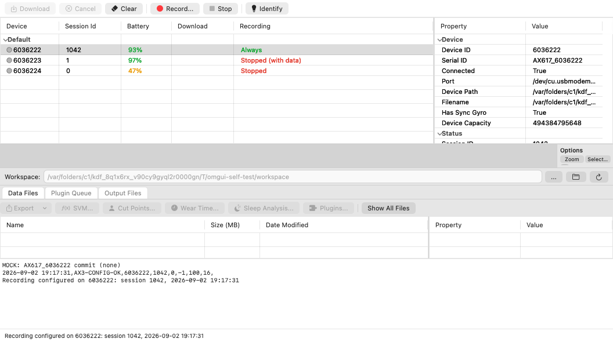
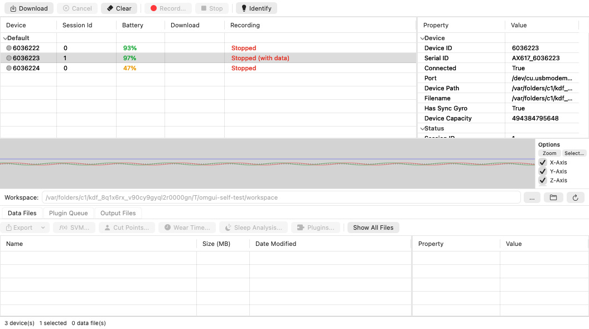
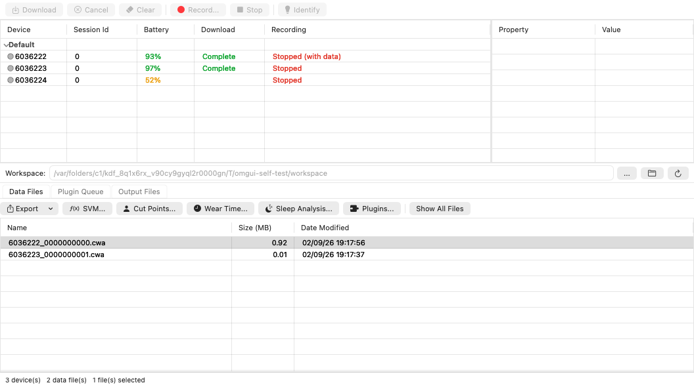
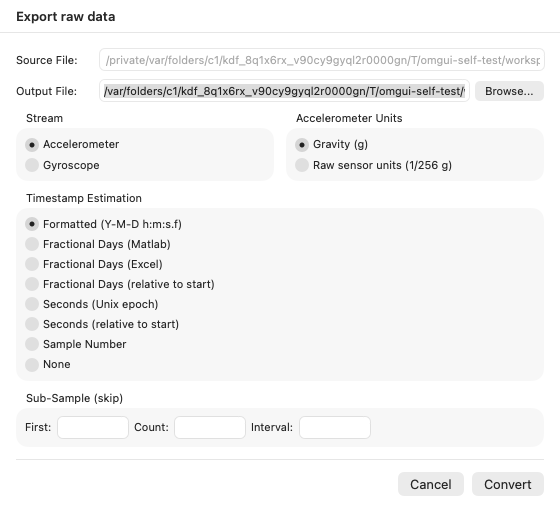
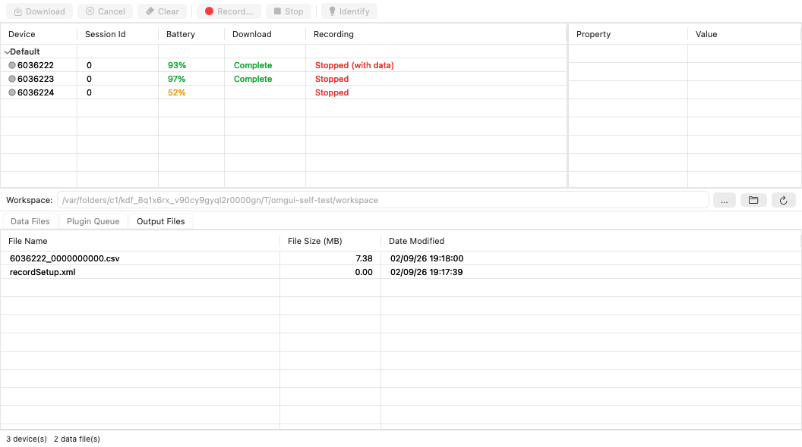

# ARIA Wearables MOP — §9.4 on macOS

**Drop-in replacement for MOP §9.4.1–9.4.4** for sites whose study computer is a Mac. The step
numbering, the step wording and Form 2 are unchanged wherever the Mac app behaves as OMGUI does;
every difference is flagged **[Mac]**. §9.4.3 is unchanged and is reproduced here only so the
section reads continuously.

The Mac app is `OmGui.app` — the same Open Movement application, rebuilt natively for macOS. The
window title reads `Open Movement [V<version>] - <workspace folder>`, exactly as on Windows.

> The screenshots in this section were taken on macOS with device **6036222**. A site's own device
> ID will differ; everything else is what the site sees.

---

## 9.4.1 Installing the software  **[Mac]**

The MOP's Windows step ("run the OmGui installer, install .NET Framework 3.5 if prompted") does not
apply. There is no .NET requirement: the Mac build is self-contained.

**Requirements:** an Apple-silicon Mac (M1 or later) running macOS 14 (Sonoma) or later.

1. Copy `OmGui-<version>.dmg` onto the study computer.
2. Double-click the `.dmg`. A window opens containing **OmGui** and a shortcut to **Applications**.
3. Drag **OmGui** onto the **Applications** shortcut.
4. Eject the disk image (click the ⏏ next to "OmGui" in the Finder sidebar).
5. Open **Applications** and double-click **OmGui** to launch it for the first time.
   *If macOS says the app "cannot be opened because the developer cannot be verified", right-click
   (or Control-click) **OmGui** ▸ **Open** ▸ **Open**. This is only needed once.*
6. **The first time a watch is plugged in**, macOS asks whether OmGui may **access files on a
   removable volume**. Press **Allow**. The app reads the watch through the volume it mounts, so if
   this is refused the device list stays empty and Download does nothing.
   To change the answer later: **System Settings ▸ Privacy & Security ▸ Files and Folders ▸ OmGui ▸
   Removable Volumes**.

On first launch the workspace (the folder downloads and exports are written to) is the Mac's
**Documents** folder, matching the Windows default. It is shown in the **Workspace** bar and in the
window title, and can be changed with the **…** button next to it.

---

## 9.4.2 Connecting device / recording configuration

1. Select a watch and make sure it is fully charged. Note down the **device ID** — the 7-digit
   number on the back of the puck — on Form 2.
2. Launch **OmGui** and connect the watch to the study computer with the mini-USB cable. The device
   appears in the device window under the group heading **Default**. Click the row to select it.

   

   The columns are **Device · Session Id · Battery · Download · Recording**, and the toolbar is
   **Download · Cancel · Clear** | **Record… · Stop** | **Identify**. A cleared, charged watch reads
   `Stopped` in the Recording column.

3. Press **Record…**.

4. The **Recording Settings** dialog opens.

   

   1. Set **Recording Session ID** to the participant number.
   2. Check that the **Sampling** settings read **Freq. (Hz) 100**, **Range (±g) 16** and
      **Gyro (±dps) (disabled)**. **[Mac]** These are already selected the first time a workspace is
      used, so normally nothing has to be changed here. The small `non-standard` note above the row
      and the yellow **WARNINGS** box ("A gyro-enabled device is being configured for accelerometer
      data only (no gyro data).") are expected with these settings and do not block anything.
   3. Leave **Recording Time** on **Immediately on Disconnect**.
   4. Press **OK**, then disconnect the watch. Note the date and time of disconnection on the
      Lasso Set-up form (Form 2, "Date recording initiated in OMGUI").

      **[Mac]** The app writes that date and time out for you. It appears in the status bar at the
      bottom of the window and in the **Log** pane (**View ▸ Log**) as:

      `Recording configured on 6036222: session 1042, 2026-09-02 19:05:27`

      The Log text can be selected and copied.

      

   After OK the device's Recording column changes from `Stopped` to `Always`, and its Session Id
   becomes the number that was entered.

### Troubleshooting: the Record button is greyed out

The watch still holds a recording. Its Recording column reads **Stopped (with data)** and only
**Download** and **Clear** are available.

Follow §9.4.4 to download and export that data first, then press **Clear** and start again at
step 3. **Do not press Clear before the data has been downloaded *and* uploaded to Lasso** — Clear
erases the watch.

---

## 9.4.3 Receiving the equipment back

Unchanged from the Windows MOP. Note the device ID of the returned watch, inspect the puck and
strap for damage, and then download the data as in §9.4.4.

---

## 9.4.4 Downloading and exporting data

1. Connect the AX6 to the study computer and select the device in the device window. If it is still
   recording (the Recording column reads `Always` or an interval), press **Stop** first. Then press
   **Download**.

   The Download column shows the progress and finishes at `Complete`. Downloading does **not** erase
   the watch.

2. Open the **Data Files** tab and select the downloaded file. It is named
   `<deviceID>_<sessionID>.cwa`, for example `6036222_0000000000.cwa`.

   

3. Press **Export** and choose **Export Raw CSV…**. In the *Export raw data* dialog leave the
   defaults (Accelerometer, Gravity (g), Formatted timestamps) and press **Convert**.

   

4. The exported file appears in the **Output Files** tab, in the workspace folder shown in the
   Workspace bar. Rename it to `ParticipantID_Visit_NamingConventionsTBD`.

   

   To open the folder in the Finder, click the folder button in the Workspace bar.

5. Upload the renamed file to Lasso.

6. Only once the file has been downloaded **and** uploaded to Lasso, select the device again and
   press **Clear** — the button with the eraser icon — to erase the watch for the next
   participant. A watch that still holds data cannot be configured for a new recording.

---

## Notes for the MOP author

* **Recording Session ID must be a whole number, 0 – 2147483647.** The field takes no letters,
  no decimal point and no thousands separator. Sites that use a non-numeric participant identifier
  need a numeric mapping, or the identifier has to go in **Subject ▸ Code** instead (which is stored
  in the file's metadata, not in the file name).
* **The file naming convention is still TBD** (§9.4.4 step 4 says
  `ParticipantID_Visit_NamingConventionsTBD`). Once it is fixed, most of it can be applied
  automatically: **Tools ▸ Options…** takes a **Filename** template, with the placeholders `{DeviceId}`,
  `{SessionId}`, `{StudyCode}` and `{SubjectCode}`, and the download is named from it. Today the
  template is `{DeviceId}_{SessionId}`. The Study/Subject fields typed into the Recording Settings
  dialog are what those placeholders expand to, so if the convention is decided in terms of fields
  the site already types, step 4's manual rename can be dropped.
* **The Form 2 date/time is now printed by the app.** §9.4.2 step 4.4 no longer relies on someone
  reading a clock: the exact line to copy is in the status bar and in the Log pane
  (`Recording configured on <device ID>: session <session ID>, <YYYY-MM-DD HH:MM:SS>`), in the study
  computer's local time.
* **Sampling defaults.** The Mac app opens Recording Settings at the MOP's values (100 Hz, ±16 g,
  gyro disabled, Immediately on Disconnect) rather than OMGUI's ±8 g, so step 4.2 is a check rather
  than a set. After the first recording the app reopens with whatever the site last used, stored per
  workspace in `recordSetup.xml`. The **Defaults** button in the dialog restores OMGUI's own
  100 Hz / ±8 g, not the MOP's values.
* **Install screenshots.** §9.4.1 is written without screenshots on purpose: the Finder and the
  macOS privacy prompt cannot be captured from inside the app, so those images have to be taken on
  a site laptop from the signed, notarised DMG that is actually distributed.
